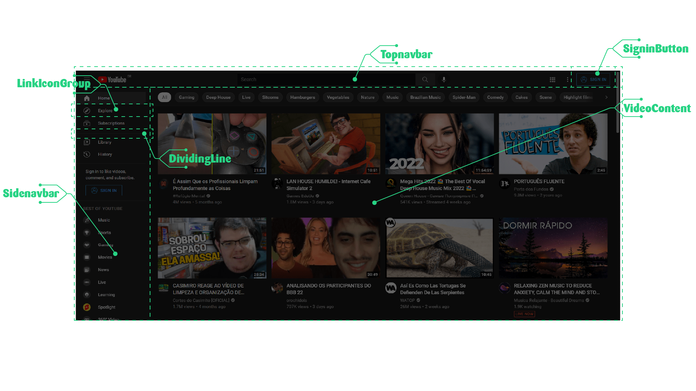
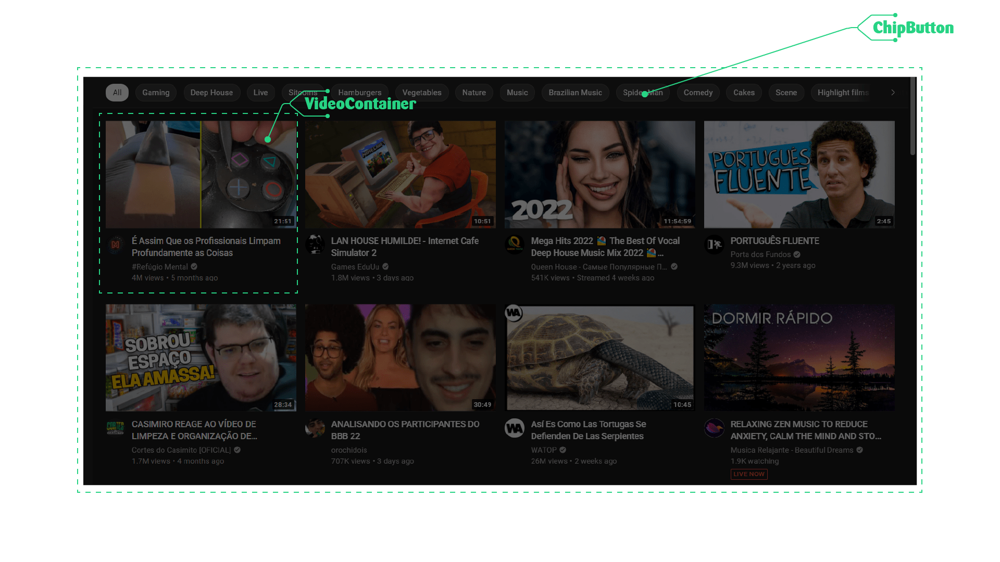

<!-- markdownlint-disable MD033 MD036 MD041 MD014 -->
<p align="center">
  
</p>
<br>
<br>

<h1 align="center"> Clone Youtube</h1>
<p align="center">💚 Desafio FortBrasil 💚</p>
<p align="center">
💻 Codificação da página principal do Youtube 💻
</p>

<br>

<p align="center">


<br>


</p>
<br>


## Sumário

- [Sumário](#sumário)
- [🔥 Desafio Escolhido](#-desafio-escolhido)
- [💡 Solução](#-solução)
  - [✔️ Componentização](#️-componentização)
- [Responsividade](#responsividade)
- [Status da Aplicação](#status-da-aplicação)
- [Iniciando a Aplicação](#iniciando-a-aplicação)
  - [Clone da Aplicação](#clone-da-aplicação)
  - [Servidor da Aplicação](#servidor-da-aplicação)
    - [Acesso da aplicação](#acesso-da-aplicação)
- [🔑 Licença de uso](#-licença-de-uso)

## 🔥 Desafio Escolhido

> Codificar o Frontend de aplicações de Streaming de vídeo como Disney+, Netflix, Prime
Vídeos..."

## 💡 Solução

### ✔️ Componentização

Escolha dos componentes de layout





## Responsividade

Dispositivos:
- [x] 4k
- [x] FullHD
- [x] HD
- [ ] Tablet
- [ ] Smartphones

## Status da Aplicação

⏸️ Projeto pausado para avaliação...

## Iniciando a Aplicação

### Clone da Aplicação

```bash
# Download do projeto
$ git clone https://github.com/Douglas-Morais/fortb-youtube.git

# Entrando na página do projeto
$ cd fortb-youtube

# Abra com o editor de sua preferência (ex. VSCode)
$ code .

# Instale as depedendências
$ npm install
```

### Servidor da Aplicação

```bash
  # desenvolvimento com hot-reload
  $ npm run dev

  # incia aplicação
  $ npm run start

  # gera arquivos para produção
  $ npm run build
```

#### Acesso da aplicação

[http://localhost:3000/docs/](http://localhost:3000/docs/)

## 🔑 Licença de uso

[MIT](LICENSE).
